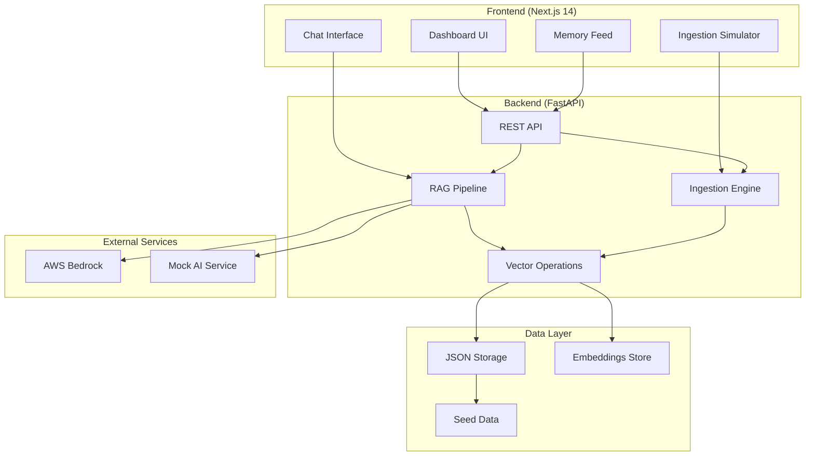

# MindStack Design Document

## Overview

MindStack is an AI-powered second brain application that implements a passive knowledge retrieval system using Retrieval Augmented Generation (RAG). The system captures unstructured data from multiple sources, processes it through vector embeddings for semantic search, and provides intelligent responses through a conversational interface.

The architecture follows a modern full-stack approach with a Next.js 14 frontend featuring a cyberpunk aesthetic and a Python FastAPI backend handling data ingestion, vector operations, and AI integration. The system is designed for rapid development and demo-ready deployment with local storage and graceful fallbacks.

## Architecture

### High-Level Architecture



### System Boundaries

- **Frontend Boundary**: Handles all user interactions, UI rendering, and state management
- **Backend Boundary**: Processes data ingestion, vector operations, and AI integration
- **Data Boundary**: Manages persistent storage and retrieval of memories and embeddings
- **External Service Boundary**: Interfaces with AWS Bedrock or mock services for AI capabilities

## Components and Interfaces

### Frontend Components

#### 1. Dashboard Component
- **Purpose**: Main application interface displaying memory feed and navigation
- **Key Features**: Masonry grid layout, cyberpunk styling, responsive design
- **State Management**: React Context for global app state
- **Animations**: Framer Motion for entrance effects and transitions

#### 2. Chat Interface Component
- **Purpose**: Persistent sidebar for natural language queries
- **Key Features**: Real-time messaging, conversation history, typing indicators
- **Integration**: Direct API calls to RAG pipeline
- **State**: Zustand store for chat history and session management

#### 3. Memory Feed Component
- **Purpose**: Visual display of captured memories in card format
- **Key Features**: Infinite scroll, filtering, search highlighting
- **Data Flow**: Fetches from `/memories` endpoint with pagination
- **Rendering**: Dynamic card components based on memory type

#### 4. Ingestion Simulator Component
- **Purpose**: Development interface for testing data capture
- **Location**: Accessible at `/devtools` route
- **Features**: Multi-format input, real-time feedback, pipeline testing
- **Integration**: Direct calls to ingestion endpoints

### Backend Components

#### 1. FastAPI Application
- **Structure**: Modular router-based architecture
- **Routers**: `/ingest`, `/query`, `/memories`, `/health`
- **Middleware**: CORS handling, request logging, error handling
- **Configuration**: Environment-based settings with fallbacks

#### 2. Ingestion Engine
- **Purpose**: Process and store incoming data from multiple sources
- **Components**:
  - Content Parser: Extracts and cleans text content
  - Metadata Extractor: Generates structured metadata
  - Embedding Generator: Creates vector representations
  - Storage Manager: Persists memories to JSON storage

#### 3. RAG Pipeline
- **Purpose**: Retrieve relevant memories and generate contextual responses
- **Components**:
  - Query Processor: Converts natural language to vectors
  - Similarity Search: Finds top-k relevant memories
  - Context Builder: Formats retrieved memories for LLM
  - Response Generator: Interfaces with AWS Bedrock or mock service

#### 4. Vector Operations Service
- **Purpose**: Handle all vector-related computations
- **Features**: Cosine similarity search, embedding storage, indexing
- **Implementation**: NumPy-based operations with FAISS-like interface
- **Performance**: In-memory caching with JSON persistence

## Data Models

### Memory Schema
```json
{
  "id": "string (UUID-v4)",
  "content": "string (main text content)",
  "metadata": {
    "type": "code | video | article | note",
    "source_url": "string (optional)",
    "language": "string (optional, for code)",
    "timestamp": "string (ISO-8601)",
    "tags": ["string array"]
  },
  "embedding": [0.12, -0.98, 0.45, "...float array"],
  "relevance_score": "float (computed during search)"
}
```

### Chat Message Schema
```json
{
  "id": "string (UUID-v4)",
  "role": "user | assistant",
  "content": "string",
  "timestamp": "string (ISO-8601)",
  "context_memories": ["array of memory IDs used"],
  "confidence_score": "float (for assistant messages)"
}
```

### Seed Data Schema
```json
{
  "memories": [
    {
      "content": "Python web scraping with BeautifulSoup example",
      "metadata": {
        "type": "code",
        "language": "python",
        "tags": ["web-scraping", "beautifulsoup", "python"]
      }
    }
  ]
}
```

## Correctness Properties

*A property is a characteristic or behavior that should hold true across all valid executions of a system-essentially, a formal statement about what the system should do. Properties serve as the bridge between human-readable specifications and machine-verifiable correctness guarantees.*

### Property 1: Memory Ingestion Completeness
*For any* valid content input (code, URL, or manual text), the ingestion process should store a complete memory with all required metadata fields (id, content, type, timestamp) and generate valid vector embeddings
**Validates: Requirements 1.1, 1.3, 2.1, 2.3, 3.2, 3.4**

### Property 2: Content Type Classification
*For any* ingested content, the system should correctly classify it as code, video, article, or note type based on the input characteristics and source
**Validates: Requirements 1.4, 2.2, 9.3**

### Property 3: Schema Validation Consistency  
*For any* stored memory, the data should conform to the defined JSON schema with UUID-v4 IDs, ISO-8601 timestamps, and consistent vector dimensionality
**Validates: Requirements 9.1, 9.2, 9.4, 9.5**

### Property 4: RAG Pipeline Retrieval
*For any* natural language query, the system should convert it to vectors, retrieve exactly 3 most similar memories ranked by relevance score, and generate responses with proper citations
**Validates: Requirements 4.1, 4.2, 4.3, 4.4**

### Property 5: Semantic Search Ranking
*For any* vector similarity search, results should be ranked by cosine similarity scores with recent memories prioritized when relevance scores are equal
**Validates: Requirements 10.1, 10.2, 10.4, 10.5**

### Property 6: Error Handling Graceful Degradation
*For any* invalid input or system error, the application should provide clear error messages, maintain system stability, and continue normal operation for valid requests
**Validates: Requirements 2.4**

### Property 7: Fallback Mode Consistency
*For any* system state, when AWS credentials are unavailable, the system should automatically switch to mock mode, provide realistic dummy responses, and clearly indicate simulation status to users
**Validates: Requirements 8.1, 8.2, 8.3, 8.5**

### Property 8: Chat Session Persistence
*For any* chat interaction, the system should maintain conversation history, preserve state across sessions, and process queries through the RAG pipeline with appropriate UI feedback
**Validates: Requirements 6.2, 6.3, 6.4, 6.5**

### Property 9: Seed Data Initialization
*For any* empty database on system startup, the system should automatically load exactly 5 predefined memories with proper embeddings and metadata, making them immediately available in the memory feed
**Validates: Requirements 11.1, 11.2, 11.3, 11.4**

### Property 10: Memory Feed Display Consistency
*For any* memory in the system, when displayed in the feed, it should show all required information (content snippets, source, timestamp) and maintain recency-based ordering
**Validates: Requirements 5.2, 5.5**

### Property 11: Ingestion Pipeline Uniformity
*For any* content processed through the simulator interface, it should follow identical ingestion, processing, and storage procedures as regular production ingestion
**Validates: Requirements 7.2, 7.3, 7.4, 7.5**
##
 Error Handling

### Frontend Error Handling
- **Network Errors**: Retry mechanisms with exponential backoff for API calls
- **UI Errors**: Error boundaries to catch React component failures gracefully
- **Validation Errors**: Real-time form validation with user-friendly error messages
- **State Errors**: Fallback states for corrupted or missing data

### Backend Error Handling
- **Input Validation**: Pydantic models for request validation with detailed error responses
- **Processing Errors**: Try-catch blocks around AI operations with fallback responses
- **Storage Errors**: File system error handling with backup mechanisms
- **Service Errors**: Graceful degradation when external services are unavailable

### Error Response Format
```json
{
  "error": true,
  "message": "Human-readable error description",
  "code": "ERROR_CODE",
  "details": {
    "field": "specific field that caused error",
    "suggestion": "recommended user action"
  }
}
```

## Testing Strategy

### Hackathon Testing Strategy

For rapid prototype development, the testing approach is streamlined to focus on core functionality validation:

**Backend Testing:**
- Standard `pytest` unit tests for critical endpoints (`/ingest` and `/query`)
- Focus on API contract validation and basic error handling
- Test the RAG pipeline with mock data to ensure proper flow

**Frontend Testing:**
- No automated tests required for the demo phase
- Focus on visual polish and user experience refinement
- Rely on manual testing through the user interface

**Manual Verification:**
- Use the `/devtools` Simulator interface to verify ingestion functionality
- Test the chat interface with various query types
- Validate the memory feed displays correctly with seed data

**Integration Testing:**
- Manual end-to-end testing through the complete user workflow
- Verify frontend-backend communication through browser developer tools
- Test fallback modes (AWS unavailable) manually

This simplified approach allows rapid development while ensuring core functionality works reliably for demonstration purposes.

## Project Structure

```
/root
  ├── /frontend (Next.js 14)
  │     ├── /app
  │     │     ├── page.tsx (Dashboard)
  │     │     ├── layout.tsx (Providers)
  │     │     └── /devtools/page.tsx (Simulator)
  │     ├── /components
  │     │     ├── /ui (Shadcn/Tailwind primitives)
  │     │     ├── MemoryFeed.tsx
  │     │     ├── ChatSidebar.tsx
  │     │     └── IngestSimulator.tsx
  │     └── /lib
  │           └── api.ts (Axios/Fetch calls)
  │
  ├── /backend (FastAPI)
  │     ├── main.py (App Entry)
  │     ├── /routers
  │     │     ├── ingest.py
  │     │     └── query.py
  │     ├── /services
  │     │     ├── vector_store.py (Mock Logic)
  │     │     └── llm_factory.py (AWS/Mock Switch)
  │     └── /data
  │           ├── db.json (The "Database")
  │           └── seed_data.json
```

This structure provides clear separation of concerns with the frontend handling all UI interactions and the backend managing data processing, storage, and AI integration. The `/data` directory serves as the local storage layer, while the `/services` directory contains the core business logic for vector operations and LLM integration.